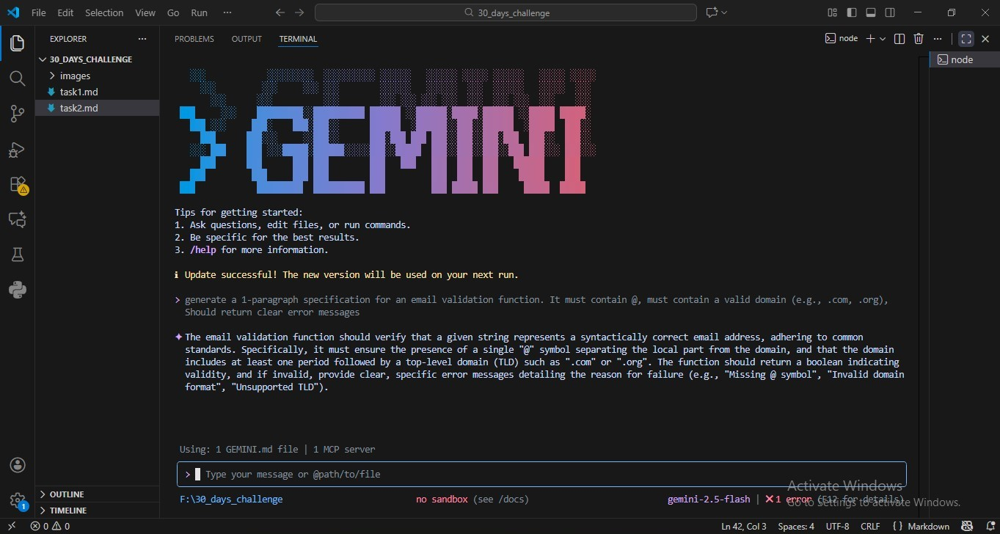

<h1 align="center"><u style="font-size: 60px;">🔵AIDD 30-Day Challenge — Task 2  by (Bilqees Shahid) 🔵</u></h1>

# 📁 Part A — Theory

---

## **Question #1: Nine Pillars Understanding**

### **a. Why is using AI Development Agents (like Gemini CLI) for repetitive setup tasks better for your growth as a system architect?**

For me, The Nine Pillars of AIDD describe a complete shift in how software is built, where AI works as your development partner instead of just a helper. AI CLI agents automate repetitive setup work directly in your terminal, freeing you from busywork and letting you focus on higher-level architectural thinking. Markdown becomes a simple language for writing clear instructions that AI can execute, while MCP allows AI to connect to tools and databases without custom integrations. AI-first IDEs like VS Code, Cursor, and Zed place AI at the center of your workflow, and a universal Linux environment ensures everything works consistently across machines. TDD provides safety by verifying all AI-generated code through tests. Specification-Driven Development (SDD) turns your Markdown specs into the main source of truth that guides the whole process. Composable skills give AI expert knowledge in any domain, and cloud tools like Docker and Kubernetes let AI produce deployment-ready systems. Together, these pillars create a smooth pipeline from natural language ideas to tested code to deployment, helping you grow faster as a system architect by reducing manual work and increasing learning opportunities.

---

### **b. Explain how the Nine Pillars of AIDD help a developer grow into an M-Shaped Developer**

For me, The Nine Pillars of AIDD make it easier for a developer to build deep skill in multiple connected areas, which is the core of becoming an M-shaped developer. AI CLI agents, AI-first IDEs, and Markdown-based specifications remove complexity and automate routine tasks, giving developers time and clarity to explore new domains. Standardized tools like Linux environments, MCP integrations, and unified cloud deployment ensure that the same workflows apply everywhere. TDD helps developers maintain confidence by validating all AI-generated work through tests. Composable skills let AI provide expert-level guidance in any chosen domain, helping developers go deeper without feeling lost. Overall, the Nine Pillars eliminate barriers, speed up learning, and let developers combine multiple areas of expertise in a natural and sustainable way supporting their growth into strong, well-rounded M-shaped developers.

---

## **Question #2: Vibe Coding vs Specification-Driven Development**

| **Vibe Coding**                                                      | **Specification-Driven Development (SDD)**                               |
| -------------------------------------------------------------------- | ------------------------------------------------------------------------ |
| Starts coding immediately, often without a plan.                     | Writes a clear specification before coding.                              |
| Ambiguous requirements lead to confusion among team members.         | Everyone follows the same spec, so expectations are clear.               |
| Skips tests or relies on manual testing.                             | Tests are written first to define expected behavior (TDD).               |
| Code grows organically and architecture drifts over time.            | Code follows the spec and is refactored safely, keeping structure clean. |
| Adding new features can break existing code.                         | New features integrate safely without disturbing old code.               |
| Problems often appear after a few days or weeks.                     | Predictable, maintainable, and easy to extend as the project grows.      |
| Team collaboration can be messy due to lack of shared understanding. | Clear specs improve collaboration and code reviews.                      |
| Hard to maintain or onboard new developers.                          | Documentation + tests make maintenance and onboarding easier.            |

---

## **Question #3: Architecture Thinking**

### **a. How does architecture-first thinking change the role of a developer in AIDD?**  
In AIDD, developers are no longer just writing individual lines of code—they become system designers. Architecture-first thinking shifts the focus from solving small problems to designing how all parts of a system work together. Developers plan the structure, data flow, and integration points first, and then let AI agents implement the code according to that blueprint. This approach turns developers into orchestrators of the system, guiding AI to produce reliable, maintainable, and scalable solutions.

### **b. Why developers must think in layers and systems instead of raw code**  
Thinking in layers and systems helps developers see the bigger picture. Each layer—like data, backend logic, frontend—has clear responsibilities. When developers design systems this way, AI-generated code fits naturally into the architecture without breaking other parts. It also makes adding features, maintaining code, and collaborating with teams easier because every piece has a clear role in the overall system. In short, focusing on systems over raw code ensures the project stays organized, flexible, and scalable as it grows.

---

# 📁 Part B — Practical Task

**Task:**  
Using any AI CLI tool, generate a 1-paragraph specification for an email validation function.

**Requirements:**  
- Must contain “@”  
- Must contain a valid domain (e.g., .com, .org)  
- Should return clear error messages  

---

# 📁 Part C — Multiple Choice Questions

1.  B. Clear requirements before coding begins  
2.  B. Thinking in systems and clear instructions  
3.  B. Architecture becomes hard to extend  
4.  B. Handle repetitive tasks so dev focuses on design & problem-solving  
5.  C. Deep skills in multiple related domains  

---

## 🌟 Reflection

After completing this task, I realize that thinking in layers and systems makes me a more strategic developer. I see that architecture-first planning prevents confusion and broken code when adding new features. Using AI effectively allows me to focus on designing robust systems rather than getting lost in raw code. Overall, I understand that clear structure, planning, and collaboration are key to building maintainable and scalable projects.

